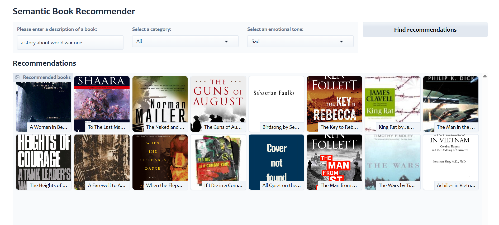

<div align="center">


**Find your next favourite book — not by keywords, but by meaning.**


[](https://huggingface.co/spaces/shrutisingh004/book-recommender)

<br/>

> *"A story about a girl who loses everything and finds herself."*
> *"An adventure set in space with themes of loneliness."*
> *"Something dark and suspenseful that I can't put down."*
>
> Just describe what you're looking for — the recommender handles the rest.

<br/>



</div>

---

## What It Does

This is a **natural language book recommender** — instead of searching by title or author, you describe the *kind* of book you want in plain English. The app uses semantic search to understand the *meaning* behind your query and matches it against thousands of book descriptions.

You can then filter results by:
- **Category** — Fiction, Non-Fiction, Mystery, Science, and more
- **Emotional tone** — Happy, Sad, Suspenseful, Angry, or Surprising

---

## How It Works

```
Your query (natural language)
│
▼
Sentence Transformer ← converts your words into a vector
(all-MiniLM-L6-v2)
│
▼
ChromaDB Vector Store ← finds the 50 closest book descriptions
│
▼
Category + Tone Filters ← narrows down to 16 final picks
│
▼
Results 
```

| Component | Technology |
|-----------|-----------|
| Semantic search | `sentence-transformers/all-MiniLM-L6-v2` |
| Vector store | ChromaDB (persisted locally) |
| Embeddings & retrieval | LangChain |
| Emotion scores | Pre-computed (joy, sadness, fear, anger, surprise) |
| UI | Gradio |

---

## ️ Project Structure

```
book-recommender/
│
├── app.py                          # Streamlit app (main entry point)
├── requirements.txt                # Python dependencies
│
├── notebooks/
│   ├── data-exploration.ipynb      # Initial data analysis and visualisation
│   ├── sentiment-analysis.ipynb    # Emotion scoring per book description
│   ├── text-classification.ipynb   # Category classification pipeline
│   └── vector-search.ipynb         # Semantic search experiments
│
├── assets/
│   └── screenshot.png              # App screenshot
│
├── books_with_emotions.csv         # Dataset with emotion scores per book
├── books_with_categories.csv       # Dataset with simplified categories
├── books_cleaned.csv               # Cleaned base dataset
├── books.csv                       # Raw dataset
│
├── tagged_description.txt          # Book descriptions tagged with ISBNs
├── cover-not-found.jpg             # Fallback cover image
│
└── chroma_db/                      # Persisted vector store (generated)
```

---

## Getting Started

### Prerequisites

- Python 3.10 or higher
- The `chroma_db/` vector store directory (generated during initial setup or provided)

### Installation

**1. Clone the repository**
```bash
git clone https://github.com/yourusername/book-recommender.git
cd book-recommender
```

**2. Create and activate a virtual environment**

*Windows (PowerShell):*
```powershell
python -m venv .venv
.venv\Scripts\Activate.ps1
```

*macOS / Linux:*
```bash
python -m venv .venv
source .venv/bin/activate
```

**3. Install dependencies**
```bash
pip install -r requirements.txt
```

**4. Set up environment variables**

Create a `.env` file in the project root:
```env
# Add any API keys here if needed
HUGGINGFACEHUB_API_TOKEN = your_token_here
```

**5. Run the app**
```bash
python app.py
```

---

## Usage

1. **Describe your ideal book** in the text box — use feelings, themes, plot elements, anything
2. **Optionally filter** by category (Fiction, Non-Fiction, etc.)
3. **Optionally filter** by emotional tone (Happy, Suspenseful, Sad, etc.)
4. Hit **Find books** and browse your personalised recommendations

### Example queries

| Query | What it finds |
|-------|--------------|
| *"A story about grief and moving on"* | Literary fiction, memoirs |
| *"Thriller with a twist ending and unreliable narrator"* | Psychological thrillers |
| *"Science and the nature of reality"* | Popular science, philosophy |
| *"A feel-good romance set in a small town"* | Contemporary romance |
| *"Epic fantasy with complex world-building"* | High fantasy |

---

## ️ Deployment

#### Hugging Face Spaces
 
The app is deployed on Hugging Face Spaces using Gradio. You can try it live at [shrutisingh004/book-recommender](https://huggingface.co/spaces/shrutisingh004/book-recommender).

---

## ️ Built With

- [Gradio](https://gradio.app) — UI framework
- [LangChain](https://langchain.com) — LLM orchestration and retrieval
- [ChromaDB](https://www.trychroma.com) — Vector database
- [Sentence Transformers](https://sbert.net) — Semantic embeddings
- [Pandas](https://pandas.pydata.org) — Data processing
